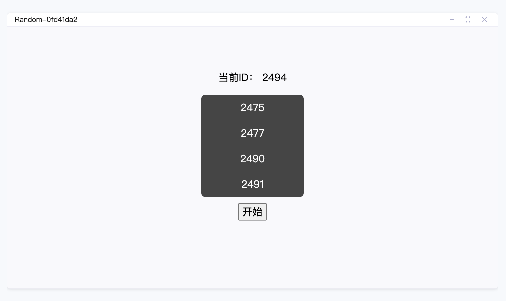

## Random

Random，给在线教育场景开发的随机选人插件。

我是一名前端初学者。刚刚入行，发现这个白板挺好玩的，就参加了这个比赛。通过学习白板的一些API写了这个小插件，写的不好还请多多包涵。

## 实现功能

实现在线互动随机选人功能并且老师不参与其中。

## 效果图

## 优化

1. 将选中的人滚动在可视区内
2. 滚动效果优化

## LICENSE

[MIT](./LICENSE)